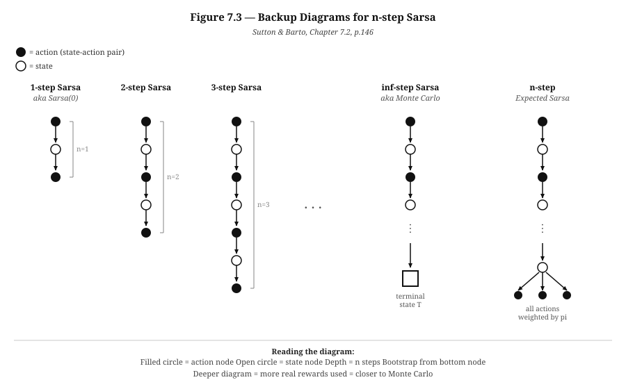

# Backup Diagram — n-step Sarsa
## Source: Sutton & Barto, Figure 7.3, Chapter 7.2, p.146

---

## What is a Backup Diagram?

A backup diagram is a visual tool that shows exactly **what information is used to update a single Q-value**.

It answers one question:

> When the algorithm updates Q(S, A), where does the new information come from?

The word "backup" comes from the idea that information **backs up** from future states and rewards to update the current state-action value. You take information from the future and use it to correct your current estimate.

---

## Why Do We Need It?

Before the backup diagram, you have the pseudocode and the formula. Both are correct but abstract. The backup diagram makes the difference between algorithms **immediately visible**.

Look at the diagram and you can instantly see:

- How many real rewards are used before bootstrapping
- Where the algorithm stops using real data and starts estimating
- How different algorithms compare structurally

Without it you have to read the formula carefully to understand the difference between 1-step Sarsa and n-step Sarsa. With the diagram, the difference is obvious in one glance — one is shallow, the other is deep.

---

## The Notation

Before reading the diagram, you need to know what the two symbols mean:

```
●  Filled circle  =  action node  (a state-action pair)
                     This is where a Q-value lives: Q(S, A)

O  Open circle   =  state node
                     This is a state S the agent visited

----->  Arrow     =  transition
                     The agent moved from one node to the next
```

The diagram is always read **top to bottom**:
- The **top node** is where the update starts — the state-action pair being updated
- Everything **below** is the information used to compute the update target G
- The **bottom node** is where bootstrapping happens (or the terminal state for Monte Carlo)

---

## The Diagram



---

## Reading Each Column

---

### Column 1 — 1-step Sarsa (Sarsa(0))

```
●   <-- Q(St, At) being updated
|
O   <-- next state St+1
|
●   <-- next action At+1  (bootstrap from here)
```

**What it means:**

The agent takes one action and immediately updates. Only one real reward (the transition from top to bottom) is used. Then it bootstraps from Q(St+1, At+1).

**In the driving analogy:**
Your coach watches one single action and gives feedback immediately. Very fast but very shallow — the verdict is based on almost no information.

**The formula:**
```
G = R_{t+1} + γ · Q(S_{t+1}, A_{t+1})
    ────────   ────────────────────────
    1 reward     bootstrap (estimate)
```

---

### Column 2 — 2-step Sarsa

```
●   <-- Q(St, At) being updated
|
O
|
●
|
O
|
●   <-- bootstrap from here
```

**What it means:**

Two real rewards are collected before bootstrapping. The update target G includes two real transitions plus one estimate at the bottom.

**In the driving analogy:**
Your coach watches two actions before giving feedback. Slightly more informed than 1-step.

**The formula:**
```
G = R_{t+1} + γ · R_{t+2} + γ² · Q(S_{t+2}, A_{t+2})
    ────────   ────────────   ─────────────────────────
    1st reward  2nd reward       bootstrap (estimate)
```

---

### Column 3 — 3-step Sarsa

```
●
|
O
|
●
|
O
|
●
|
O
|
●   <-- bootstrap from here
```

**What it means:**

Three real rewards used. The chain is longer. More real information, less reliance on an estimate.

**The formula:**
```
G = R_{t+1} + γ·R_{t+2} + γ²·R_{t+3} + γ³·Q(S_{t+3}, A_{t+3})
```

---

### Column 4 — n-step Sarsa (general case)

```
●
|
O
|
●
|
O
|
●
:   (n steps total)
:
O
|
●   <-- bootstrap from Q(S_{t+n}, A_{t+n})
```

**What it means:**

n real rewards are collected. The chain depth equals n. The bootstrap happens at the bottom of the chain — from the nth state-action pair.

This is the general algorithm from Section 7.2.

**The formula (Equation 7.4):**
```
G_{t:t+n} = R_{t+1} + γR_{t+2} + ... + γ^{n-1}·R_{t+n} + γⁿ·Q(S_{t+n}, A_{t+n})
             ──────────────────────────────────────────     ──────────────────────
                       n real rewards                            bootstrap
```

---

### Column 5 — inf-step Sarsa (Monte Carlo)

```
●
|
O
|
●
|
O
:
:   (entire episode)
:
■   <-- terminal state (square)
```

**What it means:**

The chain goes all the way down to the terminal state — the square at the bottom. No bootstrap. Every reward in the episode is used. The terminal state has Q = 0 by definition so there is nothing to bootstrap from.

**This is the deepest possible backup.** n = infinity.

**In the driving analogy:**
Your coach waits until the entire trip is over before giving any feedback. Complete information but must wait for the episode to end.

**The formula:**
```
G = R_{t+1} + γ·R_{t+2} + γ²·R_{t+3} + ... + γ^{T-t-1}·R_T
    ────────────────────────────────────────────────────────
                   ALL real rewards (no bootstrap)
```

---

### Column 6 — n-step Expected Sarsa

```
●
|
O
|
●
|
O
:
:
O
├──>●
├──>●   <-- branches to ALL possible actions
└──>●       weighted by probability under pi
```

**What it means:**

Same depth as n-step Sarsa but the final state branches out to **all possible actions** instead of just one. Each branch is weighted by the probability of taking that action under the current policy pi.

This reduces variance because instead of sampling one random action at the bottom, you take the **expected value** over all actions.

**Why the branches at the bottom:**
In regular n-step Sarsa the bootstrap term uses Q(S_{t+n}, A_{t+n}) — one specific action that was actually taken. In Expected Sarsa the bootstrap term uses the expected Q-value — the average over all actions weighted by their probabilities.

---

## The Key Insight — Depth = n

The most important thing the diagram shows is this:

```
Depth of the diagram  =  n  =  number of real rewards used
```

| Diagram depth | Algorithm | Real rewards | Bootstrap |
|---|---|---|---|
| 1 node deep | 1-step Sarsa | 1 | Yes — immediately |
| 2 nodes deep | 2-step Sarsa | 2 | Yes — after 2 |
| n nodes deep | n-step Sarsa | n | Yes — after n |
| Full episode deep | Monte Carlo | All | No |

As you go deeper:
- More real information is used
- Less reliance on potentially inaccurate bootstrap estimates
- But more variance from accumulating many random rewards
- And longer wait before the update can happen

---

## Connecting Back to the Algorithm

Every line in the pseudocode corresponds to a part of the diagram:

| Pseudocode line | What it does in the diagram |
|---|---|
| `Take action At, observe Rt+1, St+1` | Add one more node to the chain going downward |
| `tau = t - n + 1` | Count back n nodes from the current bottom |
| `G = sum of discounted rewards` | Sum up all the real transitions along the chain |
| `If tau+n < T: G += gamma^n * Q(...)` | Add the bootstrap value at the very bottom node |
| `Q(S_tau, A_tau) += alpha * [G - Q]` | Update the value at the very top node |

---

## Connecting Back to the Driving Analogy

| Diagram element | Driving analogy |
|---|---|
| Top node (filled circle) | The specific action being evaluated |
| Nodes going down | The sequence of actions your coach observed |
| Depth of the diagram | How many actions your coach watched (n) |
| Bootstrap at the bottom | Coach's estimate of how the rest of the drive would go from that point |
| Terminal square (Monte Carlo) | You reached your destination — full trip reviewed |
| Branches at bottom (Expected Sarsa) | Coach considers all possible actions you could have taken next, weighted by likelihood |

---

## Summary

```
Shallow diagram (n=1)     Deep diagram (n=inf)
      ●                         ●
      |                         |
      O                         O
      |                         |
      ●  <-- bootstrap          ●
                                |
                                O
                                :
                                :
                                ■  <-- terminal (no bootstrap)

Fast update                Slow update
High bias                  Low bias
Low variance               High variance
```

The backup diagram is not just a picture. It is a map of the algorithm's memory — how far back it looks, how much real experience it uses, and where it stops trusting real data and starts relying on estimates.

---

## Reference

Sutton, R.S. & Barto, A.G. (2018). *Reinforcement Learning: An Introduction* (2nd ed.).
MIT Press. Figure 7.3, Chapter 7: n-step Bootstrapping, p.146.